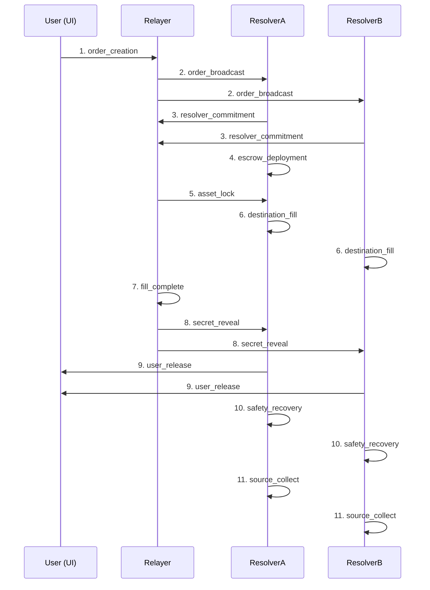

# Unite DeFi Backend Integration Guide
## DynamoDB Schema & Cross-Chain Data Requirements

This guide provides comprehensive documentation for backend teams integrating with the Unite DeFi Infrastructure Logs system. It covers exact data schemas, chain-specific requirements, and implementation guidelines for all supported blockchain networks.

---

## Table of Contents
1. [DynamoDB Table Schemas](#dynamodb-table-schemas)
2. [Supported Blockchain Networks](#supported-blockchain-networks)
3. [Trade Lifecycle & Log Types](#trade-lifecycle--log-types)
4. [Chain-Specific Implementation](#chain-specific-implementation)
5. [Data Validation & Error Handling](#data-validation--error-handling)
6. [Performance Optimization](#performance-optimization)

---

## DynamoDB Table Schemas

### 1. Trades Table

**Table Name:** `Trades`  
**Primary Key:** `tradeId` (String)  
**GSI:** `createdAt` (Number) for time-based queries

```typescript
interface Trade {
  // Required Core Fields
  tradeId: string;                    // Unique identifier (0x prefixed hash)
  status: TradeStatus;                // Current trade status
  timestamp: string;                  // ISO 8601 timestamp
  orderCreatedAt: string;             // ISO 8601 timestamp for countdown
  
  // Trade Details
  userId?: string;                    // User identifier
  makerAddress: string;               // Maker's address (chain-specific format)
  resolverAddress?: string;           // Lead resolver address
  fromToken: string;                  // Source token symbol
  toToken: string;                    // Destination token symbol
  srcAmount: string;                  // Source amount (decimal string)
  toAmount: string;                   // Destination amount ("pending" if not filled)
  fromChain: string;                  // Source chain name
  toChain: string;                    // Destination chain name
  fromChainId: number;               // Source chain ID
  toChainId: number;                 // Destination chain ID
  
  // Transaction Hashes (chain-specific formats)
  approvalTxHash?: string;           // Token approval transaction
  orderHash: string;                 // Order hash for HTLC
  secretHash: string;                // Secret hash for HTLC
  secret?: string;                   // Revealed secret (when available)
  deploySrcEscrowTxHash?: string;    // Source escrow deployment
  deployDstEscrowTxHash?: string;    // Destination escrow deployment
  lockSrcTxHash?: string;            // Source asset lock transaction
  lockDstTxHash?: string;            // Destination asset lock transaction
  unlockUserTxHash?: string;         // User fund unlock transaction
  unlockResolverTxHash?: string;     // Resolver reward unlock transaction
  
  // DynamoDB Optimization Fields
  createdAt: number;                 // Unix timestamp for GSI
  expiresAt: number;                 // Unix timestamp for TTL
}

type TradeStatus = "in_auction" | "committed" | "completed" | "rescue_available" | "failed";
```

### 2. Logs Table

**Table Name:** `Logs`  
**Primary Key:** `tradeId` (String)  
**Sort Key:** `timestamp` (String)  
**GSI:** `logType` + `timestamp` for filtering

```typescript
interface Log {
  // Required Core Fields
  tradeId: string;                   // Trade identifier (same as Trades table)
  timestamp: string;                 // ISO 8601 timestamp (sort key)
  title: string;                     // Human-readable log title
  source: LogSource;                 // Log source system
  orderId: string;                   // Order hash reference
  description: string;               // Human-readable description
  logType: LogType;                  // Specific log type for UI rendering
  
  // Type-Specific Data
  data: LogData;                     // Varies by logType (see below)
  
  // Optional Context
  txHash?: string;                   // Related transaction hash
  chainId?: number;                  // Chain ID for transaction
}

type LogSource = "UI" | "Relayer" | "ResolverA" | "ResolverB" | "ResolverC" | "ResolverD";

type LogType = 
  | "order_creation"      // 1. User creates order
  | "order_broadcast"     // 2. Relayer broadcasts to resolvers
  | "resolver_commitment" // 3. Resolver commits to fill
  | "escrow_deployment"   // 4. Escrows deployed on both chains
  | "asset_lock"          // 5. User assets locked in source escrow
  | "destination_fill"    // 6. Resolver fills destination escrow
  | "fill_complete"       // 7. All commitments fulfilled
  | "secret_reveal"       // 8. Secret revealed for HTLC unlock
  | "user_release"        // 9. Funds released to user
  | "safety_recovery"     // 10. Safety deposits recovered
  | "source_collect";     // 11. Resolver collects rewards
```

---

## Supported Blockchain Networks

### High-Value Chains ($12k TVL)
| Chain | Type | Chain ID | Address Format | Tx Hash Format | Explorer |
|-------|------|----------|----------------|----------------|----------|
| **Aptos** | Non-EVM | N/A | 0x1::account | 0x hex (64 chars) | aptoscan.com |
| **Bitcoin** | UTXO | N/A | bc1/1/3 prefixes | 64 char hex | blockstream.info |
| **Injective** | Cosmos | injective-1 | inj prefix | 64 char hex | explorer.injective.network |
| **Osmosis** | Cosmos | osmosis-1 | osmo prefix | 64 char hex | mintscan.io/osmosis |
| **Sei** | Cosmos | pacific-1 | sei prefix | 64 char hex | seitrace.com |
| **Near** | Non-EVM | mainnet | account.near | Base58 | nearblocks.io |
| **Sui** | Non-EVM | mainnet | 0x prefixed | Base58 | suiscan.xyz |
| **Tron** | Non-EVM | N/A | T prefixed | 64 char hex | tronscan.org |
| **Stellar** | Non-EVM | pubnet | G prefixed | 64 char hex | stellarchain.io |

### Medium-Value Chains ($5k-$7.5k TVL)
| Chain | Type | Chain ID | Address Format | Tx Hash Format | Explorer |
|-------|------|----------|----------------|----------------|----------|
| **Etherlink** | EVM | 42793 | 0x prefixed | 0x prefixed | explorer.etherlink.com |
| **TON** | Non-EVM | N/A | UQ/EQ prefixed | Base64 | tonscan.org |
| **Monad** | EVM | 41454 | 0x prefixed | 0x prefixed | explorer.monad.xyz |
| **Cardano** | UTXO | N/A | addr1 prefix | 64 char hex | cardanoscan.io |
| **XRP Ledger** | Non-EVM | N/A | r prefixed | 64 char hex | xrpscan.com |
| **ICP** | Non-EVM | N/A | Principal ID | 64 char hex | dashboard.internetcomputer.org |
| **Tezos** | Non-EVM | N/A | tz/KT prefixed | 51 char hash | tzkt.io |
| **Polkadot** | Non-EVM | N/A | 1 prefixed | 0x prefixed | polkascan.io |
| **EOS** | Non-EVM | N/A | 12 char names | 64 char hex | bloks.io |

### EVM Chains (Standard $ETH value)
| Chain | Chain ID | Network Type | Explorer |
|-------|----------|--------------|----------|
| **Ethereum** | 1 | Mainnet | etherscan.io |
| **Base** | 8453 | L2 | basescan.org |
| **Arbitrum** | 42161 | L2 | arbiscan.io |
| **Polygon** | 137 | Sidechain | polygonscan.com |
| **BNB Chain** | 56 | Sidechain | bscscan.com |
| **Optimism** | 10 | L2 | optimistic.etherscan.io |
| **Zircuit** | 48900 | L2 | explorer.zircuit.com |
| **Scroll** | 534352 | L2 | scrollscan.com |
| **Celo** | 42220 | EVM | celoscan.io |
| **Zora** | 7777777 | L2 | explorer.zora.energy |
| **Gnosis** | 100 | Sidechain | gnosisscan.io |
| **Unchain** | TBD | L2 | TBD |
| **Worldchain** | 480 | L2 | worldscan.org |
| **Apechain** | 33139 | L2 | apescan.io |
| **Flow EVM** | 747 | EVM | evm.flowscan.org |

---

## Trade Lifecycle & Log Types

### Complete Trade Flow with Required Logs



### 1. Order Creation Log
**Source:** `UI`  
**When:** User creates a trade order  
**Required Fields:**
```typescript
interface OrderCreationData {
  orderHash: string;        // Unique order identifier
  signature: string;        // User's signature
  secretHash: string;       // HTLC secret hash
  srcToken: string;         // Source token symbol
  dstToken: string;         // Destination token symbol
  srcAmount: string;        // Source amount (decimal string)
  dstAmount: string;        // Expected destination amount
  srcChainId: number;       // Source blockchain ID
  dstChainId: number;       // Destination blockchain ID
  makerAddress: string;     // User's address (chain-specific format)
  deadline: string;         // ISO 8601 expiration timestamp
}
```

### 2. Order Broadcast Log
**Source:** `Relayer`  
**When:** Relayer notifies all resolvers  
**Required Fields:**
```typescript
interface OrderBroadcastData {
  orderHash: string;           // Reference to order
  broadcastTimestamp: string;  // ISO 8601 timestamp
  resolversNotified: string[]; // Array of resolver addresses
  resolverCount: number;       // Total resolvers notified
}
```

### 3. Resolver Commitment Log
**Source:** `ResolverA` | `ResolverB` | `ResolverC` | `ResolverD`  
**When:** Resolver commits to partial/full fill  
**Required Fields:**
```typescript
interface ResolverCommitmentData {
  resolverAddress: string;    // Resolver's address
  commitmentHash: string;     // Commitment transaction hash
  fillAmount: string;         // Amount committed to fill
  fillPercentage: number;     // Percentage of total order (1-100)
  safetyDepositAmount: string; // Safety deposit amount
  commitmentTxHash: string;   // On-chain commitment transaction
  chainId: number;           // Chain where commitment was made
}
```

### 4. Escrow Deployment Log
**Source:** Lead resolver (highest fill %)  
**When:** Smart contracts deployed on both chains  
**Required Fields:**
```typescript
interface EscrowDeploymentData {
  resolverAddress: string;     // Lead resolver address
  srcEscrowAddress: string;    // Source chain escrow contract
  dstEscrowAddress: string;    // Destination chain escrow contract
  deploySrcTxHash: string;     // Source deployment transaction
  deployDstTxHash: string;     // Destination deployment transaction
  srcChainId: number;         // Source chain ID
  dstChainId: number;         // Destination chain ID
  gasUsed: {
    src: string;              // Gas used on source chain
    dst: string;              // Gas used on destination chain
  };
}
```

### 5. Asset Lock Log
**Source:** `Relayer`  
**When:** User's assets locked in source escrow  
**Required Fields:**
```typescript
interface AssetLockData {
  lockTxHash: string;      // Lock transaction hash
  amount: string;          // Amount locked
  token: string;           // Token symbol
  escrowAddress: string;   // Escrow contract address
  userAddress: string;     // User's address
  chainId: number;         // Source chain ID
  gasPrice: string;        // Gas price used (chain-specific unit)
}
```

### 6. Destination Fill Log
**Source:** `ResolverA` | `ResolverB` | `ResolverC` | `ResolverD`  
**When:** Resolver fills their portion in destination escrow  
**Required Fields:**
```typescript
interface DestinationFillData {
  resolverAddress: string;    // Resolver's address
  fillTxHash: string;        // Fill transaction hash
  fillAmount: string;        // Amount filled by this resolver
  token: string;             // Token symbol
  escrowAddress: string;     // Destination escrow address
  chainId: number;           // Destination chain ID
  cumulativeFilled: string;  // Total filled so far
  remainingToFill: string;   // Amount still needed
}
```

### 7. Fill Complete Log
**Source:** `Relayer`  
**When:** All resolver commitments fulfilled  
**Required Fields:**
```typescript
interface FillCompleteData {
  totalFilled: string;           // Total amount filled
  targetAmount: string;          // Target amount from order
  fillComplete: boolean;         // Always true for this log
  participatingResolvers: string[]; // All resolver addresses
  completionTimestamp: string;   // ISO 8601 completion time
}
```

### 8. Secret Reveal Log
**Source:** `Relayer`  
**When:** HTLC secret broadcast to resolvers  
**Required Fields:**
```typescript
interface SecretRevealData {
  secret: string;              // Revealed HTLC secret
  secretHash: string;          // Original secret hash
  broadcastTimestamp: string;  // ISO 8601 broadcast time
  sqsMessageId: string;        // SQS message identifier
  hashVerified: boolean;       // Secret validation result
}
```

### 9. User Release Log
**Source:** `ResolverA` | `ResolverB` | `ResolverC` | `ResolverD`  
**When:** Each resolver releases funds to user  
**Required Fields:**
```typescript
interface UserReleaseData {
  resolverAddress: string;  // Resolver performing release
  unlockTxHash: string;     // Unlock transaction hash
  amount: string;           // Amount released
  token: string;            // Token symbol
  recipient: string;        // User's address
  chainId: number;          // Destination chain ID
  secret: string;           // HTLC secret used
}
```

### 10. Safety Recovery Log
**Source:** `ResolverA` | `ResolverB` | `ResolverC` | `ResolverD`  
**When:** Resolver recovers safety deposit  
**Required Fields:**
```typescript
interface SafetyRecoveryData {
  resolverAddress: string;  // Resolver's address
  claimTxHash: string;      // Recovery transaction hash
  safetyAmount: string;     // Safety deposit amount
  token: string;            // Token symbol
  chainId: number;          // Chain where deposit was locked
  escrowAddress: string;    // Escrow contract address
}
```

### 11. Source Collection Log
**Source:** `ResolverA` | `ResolverB` | `ResolverC` | `ResolverD`  
**When:** Resolver collects rewards from source chain  
**Required Fields:**
```typescript
interface SourceCollectData {
  resolverAddress: string;  // Resolver's address
  collectTxHash: string;    // Collection transaction hash
  rewardAmount: string;     // Reward amount collected
  safetyAmount: string;     // Safety deposit collected
  totalAmount: string;      // Total amount (reward + safety)
  token: string;            // Token symbol
  chainId: number;          // Source chain ID
  escrowAddress: string;    // Source escrow address
}
```

---

## Chain-Specific Implementation

### EVM Chains (Ethereum, Base, Arbitrum, etc.)
```typescript
// Address format: 0x prefixed, 40 hex characters
address: "0x742d35Cc6634C0532925a3b8D6C9d4C0532925a3"

// Transaction hash: 0x prefixed, 64 hex characters  
txHash: "0xa1b2c3d4e5f6789012345678901234567890123456789012345678901234567890"

// Chain-specific considerations:
- Use eth_getTransactionReceipt for confirmation
- Gas prices in Wei (18 decimals)
- ERC-20 token addresses required
- Block confirmations: 12 for Ethereum, 1 for L2s
```

### Bitcoin Network
```typescript
// Address formats: Legacy (1...), SegWit (3...), Bech32 (bc1...)
address: "bc1qxy2kgdygjrsqtzq2n0yrf2493p83kkfjhx0wlh"

// Transaction hash: 64 hex characters (no 0x prefix)
txHash: "a1b2c3d4e5f6789012345678901234567890123456789012345678901234567890"

// UTXO considerations:
- Track input/output addresses separately
- Amount in satoshis (8 decimals)
- Use block height for confirmations
- Handle change addresses
```

### Cosmos Chains (Injective, Osmosis, Sei)
```typescript
// Address format: bech32 with chain prefix
injective: "inj1x2y3z4a5b6c7d8e9f0g1h2i3j4k5l6m7n8o9p0"
osmosis: "osmo1x2y3z4a5b6c7d8e9f0g1h2i3j4k5l6m7n8o9p0" 
sei: "sei1x2y3z4a5b6c7d8e9f0g1h2i3j4k5l6m7n8o9p0"

// Transaction hash: 64 hex characters (uppercase)
txHash: "A1B2C3D4E5F6789012345678901234567890123456789012345678901234567890"

// Cosmos-specific:
- Use REST API endpoints for queries
- Gas in chain-specific denominations
- IBC transfers for cross-chain
- Height-based confirmations
```

### Near Protocol
```typescript
// Address format: account.near or implicit (64 hex)
address: "alice.near" | "ed25519:H9k5eiU4xXS3M4z8HzKJa8SVX3P2b1s6..."

// Transaction hash: Base58 encoded
txHash: "FV5ZzX9P2b1s6ed25519H9k5eiU4xXS3M4z8HzKJa8S"

// Near-specific:
- Function call receipts
- Gas in TGas units
- Storage staking requirements
- Receipt-based confirmations
```

### Sui Network
```typescript
// Address format: 0x prefixed, variable length
address: "0x742d35cc6634c0532925a3b8d6c9d4c0532925a3b8d6c9d4"

// Transaction hash: Base58 encoded
txHash: "8qbHbw2BbbTHBW1sbeqakYXVKRQM8Ne7pLK7m6NYNVrg"

// Sui-specific:
- Object-based model
- Gas budget specification
- Package and module references
- Checkpoint-based finality
```

### Additional Chain Formats

#### Aptos
```typescript
address: "0x1::account::Account"
txHash: "0xa1b2c3d4e5f6789012345678901234567890123456789012345678901234567890"
// Move-based smart contracts, sequence numbers
```

#### Tron
```typescript
address: "TRX9yF4UZwURiLV2FdeEXQQQX7uT9WM65G"
txHash: "a1b2c3d4e5f6789012345678901234567890123456789012345678901234567890"
// TRX and TRC-20 tokens, energy/bandwidth system
```

#### Stellar
```typescript
address: "GAHK7EEG2WWHVKDNT4CEQFZGKF2LGDSW2IVM4S5DP42RBW3K6BTODB4A"
txHash: "a1b2c3d4e5f6789012345678901234567890123456789012345678901234567890"
// Lumens (XLM) and assets, trustlines required
```

#### TON
```typescript
address: "UQAaKHA-3E_8PjwwEOgP1zBzTlCqIu4rT7H2Yq8TpUkFUqz1"
txHash: "YmF0Y2ggdHJhbnNhY3Rpb24gaGFzaA=="
// Base64 encoded, workchain concepts
```

---

## Data Validation & Error Handling

### Required Validations

#### Address Validation
```typescript
function validateAddress(address: string, chainId: number): boolean {
  const validators = {
    // EVM chains
    1: (addr: string) => /^0x[a-fA-F0-9]{40}$/.test(addr),
    8453: (addr: string) => /^0x[a-fA-F0-9]{40}$/.test(addr),
    
    // Bitcoin
    'bitcoin': (addr: string) => /^(1|3|bc1)[a-zA-Z0-9]{25,87}$/.test(addr),
    
    // Cosmos chains
    'injective-1': (addr: string) => /^inj[0-9a-z]{39}$/.test(addr),
    'osmosis-1': (addr: string) => /^osmo[0-9a-z]{39}$/.test(addr),
    
    // Near
    'mainnet': (addr: string) => /^[a-z0-9_.-]+\.near$|^[a-f0-9]{64}$/.test(addr),
  };
  
  return validators[chainId]?.(address) ?? false;
}
```

#### Amount Validation
```typescript
function validateAmount(amount: string, decimals: number): boolean {
  // Must be positive decimal string
  const regex = new RegExp(`^\\d+(\\.\\d{1,${decimals}})?$`);
  return regex.test(amount) && parseFloat(amount) > 0;
}
```

#### Transaction Hash Validation
```typescript
function validateTxHash(txHash: string, chainType: string): boolean {
  const patterns = {
    'evm': /^0x[a-fA-F0-9]{64}$/,
    'bitcoin': /^[a-fA-F0-9]{64}$/,
    'cosmos': /^[A-F0-9]{64}$/,
    'near': /^[A-Za-z0-9+/]{43}=$/,  // Base58
    'sui': /^[A-Za-z0-9+/]{43}=$/,   // Base58
  };
  
  return patterns[chainType]?.test(txHash) ?? false;
}
```

### Error Response Format
```typescript
interface ErrorResponse {
  success: false;
  error: string;
  errorCode: string;
  details?: any;
  timestamp: string;
}

// Example error codes:
// INVALID_CHAIN_ID, INVALID_ADDRESS, INVALID_AMOUNT
// INSUFFICIENT_BALANCE, TRANSACTION_FAILED, TIMEOUT
```

---

## Performance Optimization

### DynamoDB Best Practices

#### 1. Efficient Key Design
```typescript
// Use composite sort keys for better query performance
const logId = `${timestamp}#${logType}#${source}`;

// Batch write operations
const batchWriteItems = logs.map(log => ({
  PutRequest: { Item: log }
}));
```

#### 2. Query Optimization
```typescript
// Use GSI for time-range queries
const params = {
  TableName: 'Logs',
  IndexName: 'LogTypeTimestampIndex',
  KeyConditionExpression: 'logType = :logType AND #timestamp BETWEEN :start AND :end',
  ExpressionAttributeNames: { '#timestamp': 'timestamp' },
  ExpressionAttributeValues: {
    ':logType': 'order_creation',
    ':start': startTime,
    ':end': endTime
  }
};
```

#### 3. Caching Strategy
```typescript
// Cache frequently accessed trades
const cacheKey = `trade:${tradeId}`;
const cachedTrade = await redis.get(cacheKey);

if (!cachedTrade) {
  const trade = await dynamodb.get({ TableName: 'Trades', Key: { tradeId } });
  await redis.setex(cacheKey, 300, JSON.stringify(trade)); // 5 min cache
}
```

### Rate Limiting
```typescript
// Implement rate limiting per chain
const rateLimits = {
  'ethereum': { maxTPS: 10, burstLimit: 50 },
  'bitcoin': { maxTPS: 3, burstLimit: 10 },
  'near': { maxTPS: 100, burstLimit: 1000 },
};
```

---

## Implementation Checklist

### Before Going Live
- [ ] All 11 log types implemented with correct data structures
- [ ] Chain-specific address/hash validations in place
- [ ] Error handling for all failure scenarios
- [ ] Rate limiting configured per blockchain
- [ ] Monitoring and alerting set up
- [ ] Load testing completed
- [ ] Security audit of data handling
- [ ] Backup and recovery procedures tested

### Monitoring Requirements
- [ ] Track log insertion rates per chain
- [ ] Monitor DynamoDB throttling and capacity
- [ ] Alert on missing logs in trade lifecycle
- [ ] Track transaction confirmation times
- [ ] Monitor cross-chain timing synchronization

---

## Support & Troubleshooting

### Common Issues

1. **Chain ID Mismatches**
   - Verify testnet vs mainnet chain IDs
   - Ensure consistent chain ID usage across all logs

2. **Address Format Errors**
   - Validate addresses using chain-specific formats
   - Handle case sensitivity properly

3. **Timing Issues**
   - Ensure logs are inserted in chronological order
   - Account for block confirmation delays

4. **Transaction Hash Formats**
   - Use correct encoding (hex vs base58 vs base64)
   - Include/exclude 0x prefixes as appropriate

### Contact Information
For technical support or clarifications on this schema:
- **Frontend Team**: [Contact Info]
- **Documentation Issues**: [GitHub Issues]
- **Schema Updates**: [Slack Channel]

---

*Last Updated: [Current Date]*  
*Version: 1.0*